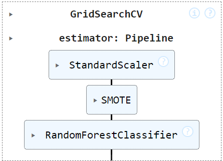
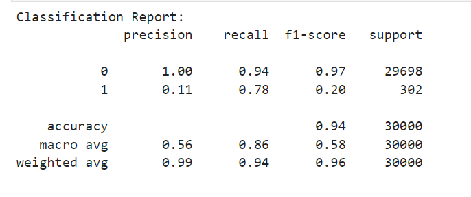
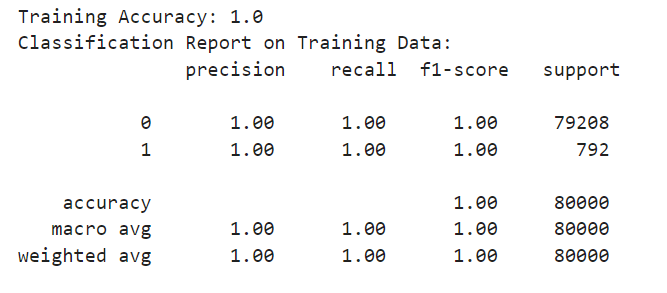
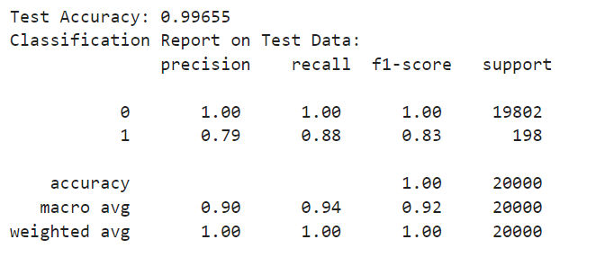

# Predicting-Credit-Card-Fraud


## Objectives

This project aims to develop a machine learning model capable of identifying fraudulent transactions. Given the challenges posed by imbalanced datasets typical in fraud detection, we employ various data preprocessing techniques, including resampling and feature scaling, and explore different models to improve prediction accuracy and recall.

## Preprocessing Steps

### Data Cleaning

The initial step in preparing our dataset for modeling involved a comprehensive data cleaning process, with a focus on handling both categorical and numerical data effectively. Here's a breakdown of our approach:

1. **Separate the Dataset**: We started by dividing our dataset into two distinct parts:
    - **Categorical Data**: Columns containing non-numeric values, representing various categories.
    - **Numerical Data**: Columns with numeric values, representing measurable quantities.

2. **Encode Categorical Data**: To make our categorical data more meaningful and easier for our models to understand, we applied frequency encoding. This process involved:
    - Creating a `frequency_map` for each categorical column, which maps each category to its frequency of occurrence within the dataset.
    - Using this map, we transformed each category into its corresponding frequency value, effectively encoding our categorical data in a way that highlights the prevalence of each category.

3. **Recombine the Data**: After encoding the categorical data and retaining our numerical data as-is, we concatenated both parts back into a single DataFrame. This recombined dataset, now with frequency-encoded categorical data and untouched numerical data, was used for all subsequent analyses and model training.

This data cleaning and preprocessing approach allowed us to maintain the richness of our dataset's categorical information in a numerical format that's more suitable for machine learning models, while also preserving the integrity of our numerical data.

### Feature Engineering

In addition to our initial data cleaning and preprocessing steps, we employed Principal Component Analysis (PCA) as a key feature engineering technique to enhance Logistic Regression model's performance further. Here's how PCA contributed to our project:

- **Dimensionality Reduction**: PCA was applied to reduce the high dimensionality of our dataset, transforming the original features into a smaller set of principal components that capture the most significant variance and patterns in the data.

- **Improving Model Efficiency and Performance**: By focusing on principal components, we were able to streamline our models, making them faster and often more accurate, as they could now learn from the most informative aspects of the data without being distracted by noise or irrelevant features.

- **Visualization**: PCA also facilitated a better understanding and visualization of the data distribution, enabling us to observe clustering patterns among the transformed features that were not apparent in the original high-dimensional space.

This step was crucial in our preprocessing pipeline, allowing us to build more robust models that are better suited to predicting fraudulent transactions while efficiently managing computational resources.

### Resampling with SMOTE

Given the inherent class imbalance typical in fraud detection scenarios, we employed SMOTEENN (a combination of Synthetic Minority Over-sampling Technique and Edited Nearest Neighbors) for resampling our dataset. This approach not only addresses the imbalance by oversampling the minority class and undersampling the majority class but also cleans the synthetic samples to remove any that are likely to be misclassified. This step was crucial in creating a more balanced dataset that allows our models to better learn and generalize from both classes.

### Feature Scaling

Post-resampling, it was essential to standardize the feature scales to ensure that our machine learning models could interpret and learn from the data effectively. We utilized `StandardScaler` from scikit-learn, which standardizes features by removing the mean and scaling to unit variance. This preprocessing step is particularly important for models that are sensitive to the magnitude of input features, such as Logistic Regression, ensuring that all features contribute equally to the model's prediction.

### StratifiedKFold Cross-Validation
To ensure our model's performance was robust and not just memorizing the training data, we used StratifiedKFold. This technique maintains class proportion across folds, critical for imbalanced datasets like ours, providing a more accurate performance assessment.

### Pipeline Implementation
The pipeline streamlined the process, applying SMOTE for class imbalance and StandardScaler for scaling before training the Random Forest model. This not only automated the workflow but also prevented data leakage by ensuring transformations were fit only on the training data within each fold.

```python
from sklearn.preprocessing import StandardScaler
from imblearn.combine import SMOTE
from sklearn.linear_model import LogisticRegression
from imblearn.pipeline import Pipeline as ImbPipeline

# Call and define that includes scaling, SMOTE, and RF
pipeline = ImbPipeline([
    ('scaler', StandardScaler()),
    ('smote', SMOTE(random_state=42)),
    ('classifier', RandomForestClassifier(random_state=42))
])
```


## Model Development

Throughout this project, we explored various machine learning models to tackle the challenge of fraud detection, leveraging the powerful libraries provided by scikit-learn for implementation and evaluation. Below is an overview of the models we experimented with, along with the rationale and methodology behind each choice.

### Logistic Regression

Initially, we applied **Logistic Regression**, a widely used linear model for binary classification tasks, to establish a baseline performance. This step allowed us to gauge the model's capability to distinguish between fraudulent and non-fraudulent transactions based on the original feature set without any dimensionality reduction.

#### Libraries Used:
- scikit-learn for model training (`LogisticRegression` class) and evaluation metrics.

### Logistic Regression

To investigate the impact of dimensionality reduction on model performance, we subsequently applied **PCA (Principal Component Analysis)** to our dataset before training the Logistic Regression model. This approach aimed to reduce the complexity of the data, potentially enhancing model training efficiency and effectiveness by focusing on the most informative aspects of the data.

#### Libraries Used:
- scikit-learn for PCA implementation (`PCA` class) and Logistic Regression.

### Random Forest Model

Seeking to leverage the benefits of ensemble learning, we then explored the **Random Forest** model. Known for its robustness and ability to handle imbalanced datasets, the Random Forest model offered a more sophisticated approach compared to the simplicity of Logistic Regression, potentially providing higher accuracy and better generalization.

#### Libraries Used:
- scikit-learn for model training (`RandomForestClassifier` class) and evaluation metrics.

### Hyperparameter Tuning with Grid Search

To further optimize our model's performance, specifically the Random Forest classifier, we employed **Grid Search CV** for hyperparameter tuning. This exhaustive search over specified parameter values aimed to identify the most effective combination of parameters that results in the best model performance.

#### Libraries Used:
- scikit-learn for Grid Search CV (`GridSearchCV` class) and model evaluation.

## Model Evaluation

### Evaluation Methodology

**Performance Metrics**: Understanding the nuances of model performance in the context of fraud detection required us to look beyond mere accuracy. We employed several key metrics to gain a comprehensive view of each model's effectiveness:
   - **Accuracy**: The proportion of total predictions that were correct.
   - **Precision (Positive Predictive Value)**: Of all transactions predicted as fraudulent, the percentage that were correctly identified.
   - **Recall (Sensitivity)**: Of all actual fraudulent transactions, the percentage that were correctly identified by the model.
   - **F1 Score**: A harmonic mean of precision and recall, providing a single metric to assess the balance between them.
   - **ROC-AUC**: The Area Under the Receiver Operating Characteristic Curve, measuring the model's ability to distinguish between classes.

### Model Performance

- **Logistic Regression : Served as our baseline model. While offering decent accuracy, it struggled with recall, indicating a potential issue with identifying the minority class (fraudulent transactions).



- **Random Forest with Tuned Hyperparameters**: The application of GridSearchCV to fine-tune the Random Forest model's hyperparameters further improved performance. This model demonstrated the highest F1 score, recall, and precision, underlining the value of hyperparameter tuning in optimizing model outcomes.



### Random Forest Model on Test Data

- The ultimate test of a model's utility is its performance on new, unseen data. The tuned Random Forest model not only showed promising results during training but also demonstrated excellent generalization capabilities on an independent test dataset. With high precision and recall for detecting fraudulent transactions in the test data, the model confirmed its practical applicability and effectiveness in a real-world scenario.



### Conclusions and Discussion

- 1. Challenges with Logistic Regression in Imbalanced Classification
The Logistic Regression model showed excellent performance in predicting non-fraudulent transactions with near-perfect precision, recall, and F1-score for the majority class (non-fraud). However, it struggled significantly with the minority class (fraud), as evidenced by the low precision yet high recall for fraud predictions. This highlights a common challenge in imbalanced datasets where models tend to perform well on the majority class but poorly on the minority class, which is often the class of interest.

Conclusion: While Logistic Regression could effectively identify non-fraudulent transactions, its performance on detecting fraudulent transactions was inadequate, emphasizing the need for more sophisticated models or techniques to address class imbalance effectively.

- 2. Exemplary Performance of the Tuned Random Forest Model
By employing a Random Forest model and optimizing its parameters through Grid Search, we constructed a highly accurate model for both training and unseen data. The model achieved perfect scores in precision, recall, and F1-score across both classes on the training set, and it maintained high performance on the test set. Although the model's perfect training accuracy might initially suggest overfitting, the strong performance on the test data indicates that the model generalizes well to new data.

Conclusion: The Random Forest model, when carefully tuned, provided an exceptional solution to the credit card fraud detection problem, outperforming Logistic Regression significantly in handling the imbalanced dataset, particularly in identifying fraudulent transactions with high accuracy.

- 3. Generalization and Effectiveness on New Test Data

The ultimate test of a model's utility is its performance on new, unseen data. The tuned Random Forest model not only showed promising results during training but also demonstrated excellent generalization capabilities on an independent test dataset. With high precision and recall for detecting fraudulent transactions in the test data, the model confirmed its practical applicability and effectiveness in a real-world scenario.

Conclusion: The tuned Random Forest model's robust performance on both training and new test data underscores its effectiveness in detecting fraudulent transactions within credit card data. It showcases the potential of machine learning models, properly optimized and evaluated, to provide valuable tools in combating financial fraud.
These conclusions encapsulate the journey from identifying the limitations of a simpler model in handling imbalanced data, through the process of selecting and tuning a more complex model, to validating this model's effectiveness on unseen data, thereby illustrating the project's success in developing a reliable solution for credit card fraud detection.
